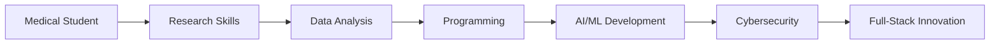

# 🏥💻 Muhammad Usman - Medical Tech Portfolio


## 🚀 **Live Portfolio**
**Visit:** [https://usman0220.github.io](https://usman0220.github.io)

---

## 👨‍⚕️ **About Me**

I'm **Muhammad Usman**, a 4th-year medical student at **CMH Multan Institute of Medical Sciences (CIMS)**, Pakistan, with a unique passion for bridging medicine and technology.

### 🎯 **My Mission**
> *"Leveraging technology to revolutionize healthcare and medical research while ensuring digital security and innovation."*

---

## 🧠 **Core Domains**

### 🏥 **Medical & Research**
- **Specializations:** Community Medicine, Ophthalmology, Emergency Medicine
- **Research:** Systematic Reviews & Meta-Analysis (PRISMA, RevMan, JBI)
- **Analysis:** Clinical Data Interpretation, Medical Imaging (X-rays, fundus, histology)

### 💻 **Technical Skills**
- **Languages:** Python, C, SQL, Shell Scripting
- **AI/ML:** OpenCV, Scikit-learn, Pandas, NumPy, Matplotlib
- **Data Tools:** SPSS, Excel, R, Git/GitHub

### 🔐 **Cybersecurity**
- **Expertise:** Web App Security, XSS Detection, SQL Injection, Directory Fuzzing
- **Tools:** Burp Suite, Nmap, Wireshark, XSStrike, SQLMap, Termux
- **Focus:** Bug Hunting, Network Reconnaissance, Mobile Security

---

## 🛠️ **Featured Projects**

### 🩺 **1. Diabetic Retinopathy Detector**
**AI-powered medical imaging tool**
- **Tech Stack:** Python, OpenCV, Machine Learning
- **Purpose:** Early detection of diabetic retinopathy from retinal images
- **Impact:** Potential for improving diabetic patient outcomes

### 🛡️ **2. XSS Detection Suite**
**Automated cybersecurity scanner**
- **Tech Stack:** Python, Burp Suite, XSStrike
- **Purpose:** Detect reflected & stored XSS vulnerabilities
- **Achievement:** Discovered multiple real-world vulnerabilities

### 📊 **3. Meta-Analysis: Vitamin D & COVID-19**
**Comprehensive medical research**
- **Methodology:** PRISMA-based systematic review
- **Tools:** RevMan, Rayyan
- **Scope:** Analysis of 20+ randomized controlled trials

### 📱 **4. Termux-Automator**
**Android penetration testing suite**
- **Tech Stack:** Bash, ADB, Termux
- **Purpose:** Automate mobile security testing workflows
- **Innovation:** Streamlined Android security assessment

### 🔍 **5. URL Fuzzing App** *(Ongoing)*
**Live penetration testing tool**
- **Tech Stack:** Python, Flask
- **Purpose:** Directory fuzzing with online wordlists
- **Target:** Enhanced web application security testing

---

## 🏆 **Achievements & Recognition**

### 🥇 **Academic Excellence**
- **1st Place** - Ophthalmology Quiz, CIMS
- **Multiple High-Quality Literature Reviews** - Systematic reviews and meta-analyses

### 📜 **Certifications**
- ✅ **eHunar AI Course** - Punjab Government Initiative
- ✅ **Systematic Review & Meta-Analysis** - Cochrane & JBI Methodologies  
- ✅ **Python & Data Science** - Coursera & Udemy Certified
- ✅ **Cybersecurity Essentials** - Cisco Certified

### 🔍 **Security Research**
- **Real-World XSS Vulnerabilities** - Responsible disclosure of security flaws
- **AI Prototypes for Healthcare** - Innovative medical technology solutions

---

## 💼 **Portfolio Features**

### 🎨 **Design & UX**
- **Responsive Design** - Optimized for all devices
- **Modern UI/UX** - Clean, professional aesthetic
- **Smooth Animations** - Enhanced user experience
- **Interactive Elements** - Engaging portfolio showcase

### ⚡ **Technical Implementation**
- **Pure HTML/CSS/JS** - No frameworks, optimized performance
- **SEO Optimized** - Better search engine visibility
- **Accessibility Ready** - WCAG compliant design
- **Fast Loading** - Optimized assets and code

### 📱 **Mobile First**
- **Responsive Navigation** - Hamburger menu for mobile
- **Touch Optimized** - Mobile-friendly interactions
- **Cross-Browser Compatible** - Works on all modern browsers

---

## 🌐 **Connect With Me**

[](mailto:muhammadusman.cims@gmail.com)
[](https://github.com/Usman0220)
[](https://linkedin.com/in/usmanmed)
[](https://twitter.com/usmanmedic)

---

## 📁 **Repository Structure**

```
Usman0220.github.io/
├── index.html          # Main portfolio page
├── styles.css          # Styling and responsive design
├── script.js           # Interactive functionality
├── README.md           # Project documentation
└── assets/             # Images and media files (future)
```

---

## 🚀 **Getting Started**

### **Local Development**
```bash
# Clone the repository
git clone https://github.com/Usman0220/Usman0220.github.io.git

# Navigate to project directory
cd Usman0220.github.io

# Open in your preferred code editor
code .

# Serve locally (using Python)
python -m http.server 8000
# OR using Node.js
npx serve .
```

### **Deployment**
The portfolio is automatically deployed via **GitHub Pages** at:
**https://usman0220.github.io**

---

## 🎯 **Future Enhancements**

- [ ] **Blog Section** - Medical and tech articles
- [ ] **Project Demos** - Interactive project showcases
- [ ] **Dark Mode** - Theme toggle functionality
- [ ] **Multilingual Support** - Urdu language option
- [ ] **Performance Metrics** - Real-time analytics
- [ ] **Contact Form Backend** - Functional message handling

---

## 📈 **Skills Progression**



---

## 🤝 **Collaboration Opportunities**

I'm always interested in:
- 🏥 **Medical Technology Projects**
- 🔬 **Healthcare AI/ML Research**
- 🛡️ **Cybersecurity Collaborations**
- 📊 **Systematic Review Partnerships**
- 🌍 **Open Source Contributions**

---

## 📄 **License**

This portfolio is open source and available under the [MIT License](LICENSE).

---

<div align="center">

### 🌟 **"Bridging Medicine & Technology for a Better Tomorrow"** 🌟

**Made with ❤️ by Muhammad Usman**

*Last Updated: December 2024*

</div>

